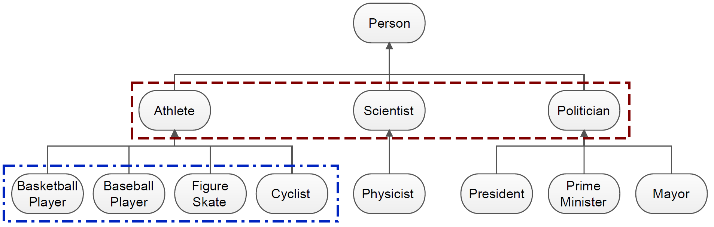

.. _feature-selection-label:

========================================
Hierarchical Feature Selection
========================================

Idea
^^^^^^^^^^^^^^^^^^^

Using the :doc:`usage_generators` provided in this package will often result in a lot of attributes. Thus, it can be benificial to filter the attributes before performing further analysis. Besides standard feature selection methods (e.g. removing correlated attributes, attributes with many missings, or attributes with little variation) that might be usefull for this task, this package comes with a collection of feature selection approaches, that work by exploiting the semantics of Linked Open Data sources to filter the attributes created by the generators. 

.. _note_supported_generators:

.. note::
   For the provided Feature Selection algorithms work only with the following generators:

   * :ref:`Direct Type Generator <direct_type_generator>`
   * :ref:`Qualified Relation Generator <qualified_relation_generator>`
   * :ref:`Specific Relation Generator <specific_relation_generator>`

   Also, for them to work you need a **Label Column** in your data which can be used by the algorithms to evaluate the predictive power of the features.

Theorectical Background
^^^^^^^^^^^^^^^^^^^^^^^^^

Basics
--------------------------------

Before hierarchical feature selection can be performed, first a hierarchy graph needs to be built. The graph contains the hierarchical dependencies of all attributes that were created by a generator. The hierarchy graph is created by recursively querying a selected hierarchy relation (by default the `rdfs:subClassOf <https://www.w3.org/TR/rdf-schema/#ch_subclassof>`_ property). The process starts by first querying the selected hierarchy relation for each of the generated attribute. It then continues to query the resulting superclasses for theirs superclasses, until a full hierarchy tree was created.

Example
--------------------------------

Imagine we have a dataset containing tweets, which is supposed to be used for topic classification. We alread extracted all *types* of the DBpedia concept discovered in each tweet using the :meth:`Direct Type Generator <kgextension.generator.direct_type_generator()>`. In the same step we also already extracted a hierarchy graph as the ``hierarchy`` argument was set to **True**. The resulting hierarchy graph is already embedded into the DataFrame returned by the generator.

In :numref:`feature_space_twitter` you can see a small part of the extracted hierarchy graph. Based on this example, we can explain why it can make sense to perform Hierarchical Feature Selection.

.. _feature_space_twitter:

    Small part of the hierarchy graph extracted for the Twitter dataset. :cite:`shsel_filter`.
    
If, for instance, the task would be to classify tweets into *sports related* and *non sports related*, the optimal features would be those in the upper rectangle. However, if the task would be to classify the tweets by different kinds of sports, then the features in the lower rectangle would be more valuable. 

Hierarchical Feature Selection is about automating the discovery of these patterns of relevant features. 

Provided Approaches
^^^^^^^^^^^^^^^^^^^^^

All provided approaches aim to, in one way or another, reduce the amount of redundant features by examining the hierarchical structure between the generated features, as well as the predictive power of the features based on some metric (e.g. information gain).

This package includes the following approaches:

* **Hill Climbing Filter (HC)**: Hill Climbing is a bottom up approach which uses the purity of nearest neighbors of all instances in a dataset to assign scores to attributes. *Paper:* :cite:`hc_filter`
* **Tree Based Filter (TSEL)**: TSEL selects the most valuable attributes from each branch in the hiearchy, based on information gain or lift. *Paper*: :cite:`tsel_filter`
* **Hierarchy Based Filter (SHSEL)**: SHSEL eliminates redundant attributes along hierarchy paths, while pruneSHSEL further reduces the feature set by selecting only the most relevant attributes of the reduced hierarchy. For both algorithms, the underlying relevance measure can be correlation or information gain. *Paper*: :cite:`shsel_filter`
* **Greedy Top Down Filter (GTD)**: Greedy top down selects attributes that have a high information gain ratio, while pruning those attributes that are adjacent to the selected ones in the hierarchy. *Paper*: :cite:`gtd_filter`

.. note::
    This overview was taken from :cite:`RLEmanual`.

A detailed comparison and evaluation on the filtering algorithms can be found in :cite:`shsel_filter`.

Usage
^^^^^^^^^^^^^^^^^^^^^

Preparation
--------------------------------------

For the provided Feature Selection algorithms to work you need a **hierarchy graph** of the generated attributes. As mentioned :ref:`above <note_supported_generators>`, the creation of this graph is only supported by the following generators:

* :ref:`Direct Type Generator <direct_type_generator>`
* :ref:`Qualified Relation Generator <qualified_relation_generator>`
* :ref:`Specific Relation Generator <specific_relation_generator>`

To create a hierarchy graph it is sufficient to set the ``hierarchy`` argument of these generators to **True**, as in this example:

.. code-block:: python

    from kgextension.generator import direct_type_generator

    data_expanded = direct_type_generator(data_linked, "new_link", hierarchy=True)

The resulting hierarchy graph is appended to the result DataFrame returned by the generator and can, if of interest, be accessed as follows:

.. code-block:: python

    data_expanded.attrs["hierarchy"]

Hill Climbing Filter (HC)
--------------------------------------

To perform Hierarchical Feature Selection using the Hill Climbing Filter, you simply call the :meth:`hill_climbing_filter() <kgextension.feature_selection.hill_climbing_filter()>` method, as in the following minimal example:

.. code-block:: python

    from kgextension.feature_selection import hill_climbing_filter

    data_filtered = hill_climbing_filter(data_expanded, "class")

The ``data_expanded`` DataFrame is the one created in `Preparation`_.

Tree Based Filter (TSEL)
--------------------------------

To perform Hierarchical Feature Selection using the Tree Based Filter, you simply call the :meth:`tree_based_filter() <kgextension.feature_selection.tree_based_filter()>` method, as in the following minimal example:

.. code-block:: python

    from kgextension.feature_selection import tree_based_filter

    data_filtered = tree_based_filter(data_expanded, "class")

The ``data_expanded`` DataFrame is the one created in `Preparation`_.

Hierarchy Based Filter (SHSEL)
--------------------------------

To perform Hierarchical Feature Selection using the Hierarchy Based Filter, you simply call the :meth:`hierarchy_based_filter() <kgextension.feature_selection.hierarchy_based_filter()>` method, as in the following minimal example:

.. code-block:: python

    from kgextension.feature_selection import hierarchy_based_filter

    data_filtered = hierarchy_based_filter(data_expanded, "class")

The ``data_expanded`` DataFrame is the one created in `Preparation`_.

Greedy Top Down Filter (GTD)
--------------------------------

To perform Hierarchical Feature Selection using the Greedy Top Down Filter, you simply call the :meth:`greedy_top_down_filter() <kgextension.feature_selection.greedy_top_down_filter()>` method, as in the following minimal example:

.. code-block:: python

    from kgextension.feature_selection import greedy_top_down_filter

    data_filtered = greedy_top_down_filter(data_expanded, "class")

The ``data_expanded`` DataFrame is the one created in `Preparation`_.

.. bibliography::
    :filter: docname in docnames